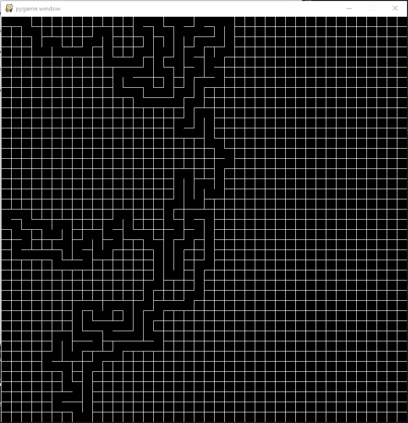
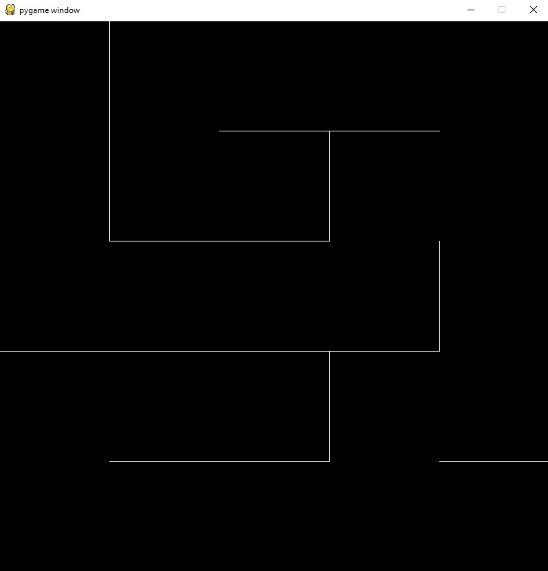
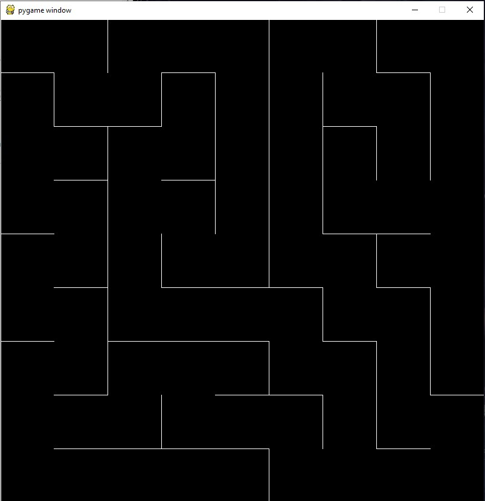

# R3-SoftwareTraining2-AndrewGao

## Milestone #1
Created a python program that generates a random maze everytime the program is run given a number n for n x n grid

## Steps
- Used recursive backtracker algorithm for maze generation
1. Choose a starting cell
2. Randomly choose an adjacent cell that is unvisited and remove a side between the current cell and adjacent cell
3. If all adjacent cells have been visited, go back to the last cell that has no sides removed and repeat
4. Maze is generated when all cells have been visited

- Program starts by generating a n x n grid based on the value of n (random number between 5 and 50)
- Maze is generated in real life at 60FPS

## Milestone #2
Created a send and receive program on python using the TCP communication protocol, each step will take 1 second, therefore a new command is sent every 1 second until the end of the solution array has been reached. At the end send a final string of “[0][0][0][0]” to stop. Maze's path solution was provided in advance.

## Steps
- Never used socket with python, so did research on https://pythonprogramming.net/sockets-tutorial-python-3/ (most tcp code copied from there)
1. Used cardinal coordinates (North, East, South, West) to help determine which way to turn (left or right)
2. Converted maze path solution to “[M1_A][M1_B][M2_A][M2_B]” format for robot to understand
3. Created the client inside the provided maze python file to send commands over to server.py

- run server.py first, then maze.py
- maze solution path is indicated by circles, while server receives commands
